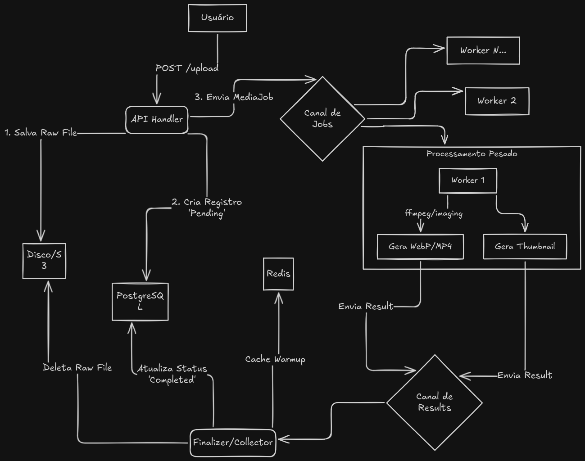

# 3. Concorrência e Pipeline de Processamento

Esta é a "Sala de Máquinas" do backend. Para atender ao princípio da **assincronicidade**, o processamento de mídia ocorre em um pipeline robusto, desacoplado da API principal.

## 3.1 O Fluxo do Pipeline de Processamento

O pipeline garante que o processamento de mídia seja eficiente, gerenciável e resiliente. Ele é composto por quatro estágios principais, seguindo o padrão **Fan-Out/Fan-In**.

*Figura 1: Diagrama do fluxo de trabalho, desde o upload até a finalização.*

---

### Estágio 1: Ingestion (Handler da API)
*   **O que faz:** Recebe a requisição de upload (`multipart/form-data`), valida metadados básicos e salva o arquivo bruto (`raw file`) em um armazenamento temporário.
*   **Ação Crítica:** Imediatamente insere um novo registro de `Post` no banco de dados com `status: pending`.
*   **Próximo Passo:** Envia um `MediaJob` (uma struct contendo informações sobre o post e o caminho do arquivo) para um **canal Go** que atua como a entrada do pipeline.
*   **Padrão Go:** Utiliza **Closure Injection** para injetar dependências como a conexão com o banco e o canal do pipeline no handler HTTP.

### Estágio 2: Dispatcher (Channel - O Buffer)
*   **O que faz:** O canal Go atua como uma fila (buffer) que segura os `MediaJobs` até que um `Worker` esteja livre.
*   **Função:** Atua como um mecanismo de **Backpressure**. Se o canal estiver cheio (ou seja, os workers não estão conseguindo processar na mesma velocidade da chegada de novos jobs), a API pode sentir essa "pressão" e, em vez de aceitar o upload e travar, pode retornar um erro `429 Too Many Requests` ou `503 Service Unavailable`. Isso protege o sistema de ser sobrecarregado por ataques de upload ou picos de tráfego.

### Estágio 3: Fan-Out (Worker Pool)
*   **O que faz:** Um conjunto de `N` Goroutines (`Workers`) opera em paralelo, consumindo `MediaJobs` do canal do Dispatcher. O número de workers é geralmente baseado em `runtime.NumCPU()` para otimizar o uso do hardware sem causar exaustão de recursos.
*   **Lógica do Worker:**
    1.  Muda o status do Post no DB para `processing`.
    2.  Executa as tarefas pesadas de processamento:
        *   **Imagens:** Decodificação -> Redimensionamento -> Compressão para `WebP`.
        *   **Vídeos:** Extração de metadados -> Transcodificação (FFmpeg para `mp4`) -> Geração de Thumbnail.
    3.  Cada worker opera com um `Context` que inclui um `Timeout`. **Por que?** Para evitar que processos de mídia travados (ex: um vídeo corrompido que faz o FFmpeg entrar em loop) consumam recursos indefinidamente. Se o timeout expirar, o worker cancela a operação.
*   **Próximo Passo:** Após o processamento (com sucesso ou falha), o `Worker` envia o resultado para um `Channel de Resultados`.

> **💡 Fairness (Justiça):** Uma otimização futura pode ser a criação de **filas (canais) separadas para vídeo e imagem**. Isso evita que o processamento de vídeos (tipicamente mais lento) bloqueie o processamento de imagens (mais rápido), garantindo uma melhor distribuição de recursos.

### Estágio 4: Fan-In (Finalizer/Collector)
*   **O que faz:** Uma **única goroutine** central consome os resultados do `Channel de Resultados`.
*   **Por que uma única goroutine?** Para garantir consistência e prevenir `Race Conditions` ao interagir com o banco de dados e o sistema de arquivos, que são recursos compartilhados.
*   **Responsabilidades Críticas:**
    1.  **Atualizar o DB:** Atualiza o `status` do `Post` para `completed` ou `failed` e grava os metadados da mídia otimizada.
    2.  **Limpeza:** Deleta o arquivo `raw` original do armazenamento temporário.
    3.  **Cache:** Invalida ou aquece (`warm up`) o cache no Redis para refletir o novo estado.

---

## 3.2 O Sistema de Manutenção (Janitor / Reaper)

O `Janitor` (também chamado de "zelador" ou "reaper") é um processo independente, essencial para a **resiliência** do sistema.

*Figura 2: Diagrama do processo de manutenção do Janitor.*

*   **Problema:** O que acontece se um `Worker` sofrer um `panic` ou o servidor for reiniciado bruscamente? Teremos posts presos no estado `processing` para sempre ("estados zumbis") e arquivos órfãos no disco.
*   **Solução (O Janitor):**
    1.  **Funcionamento:** Baseado em um `time.Ticker`, ele roda periodicamente (ex: a cada 15 minutos).
    2.  **Ação:** Executa uma query no banco de dados para encontrar `Posts` que estão com o status `processing` por um tempo excessivo (ex: mais de 30 minutos).
    3.  **Correção:** Para cada post encontrado, ele atualiza o `status` para `failed` e tenta limpar quaisquer arquivos temporários associados.
*   **Objetivo Final:** Garantir a **consistência eventual** do sistema. O Janitor atua como um mecanismo de auto-recuperação, prevenindo que dados fiquem em estados inconsistentes e liberando recursos que foram deixados para trás.
