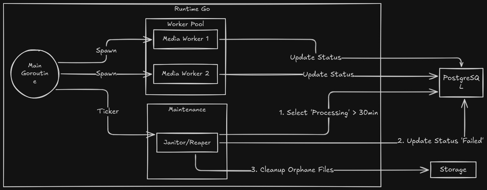

#  MemeDroid (videoloader) Backend

**MemeDroid** é o backend para uma plataforma de rede social focada em mídia (memes/vídeos), construída com Go.

O projeto é projetado para ser **altamente performático e resiliente**, utilizando uma arquitetura de processamento assíncrono para lidar com uploads e otimização de mídia em escala.
---
# **MODELO MENTAL: esboco inicial**

---

## 🚀 Sobre o Projeto

O objetivo principal é fornecer uma API robusta capaz de gerenciar um grande volume de conteúdo de mídia, com foco em:
*   **Performance:** Respostas rápidas da API, desacoplando tarefas pesadas.
*   **Resiliência:** Capacidade de se recuperar de falhas de processamento.
*   **Escalabilidade:** Arquitetura pensada para crescer.

## 📚 Documentação da Arquitetura

Toda a arquitetura, conceitos e decisões de design do projeto estão detalhados na nossa documentação. Para entender como o sistema funciona, por favor, comece por aqui:

*   [**01 - Visão Geral do Projeto**](./.docs/01-visao-geral-do-projeto.md)
*   [**02 - Arquitetura de Dados**](./.docs/02-arquitetura-de-dados.md)
*   [**03 - Concorrência e Pipeline de Processamento**](./.docs/03-concorrencia-e-pipeline-de-processamento.md)
*   [**04 - Organização do Código**](./.docs/04-organizacao-do-codigo.md)
*   [**05 - Observabilidade**](./.docs/05-observabilidade.md)
*   [**06 - Princípios e Fundamentos Arquitetônicos**](./.docs/06-principios-e-fundamentos-arquitetonicos.md)

---

## 🛠️ Stack Principal

*   **Linguagem:** Go (Golang)
*   **Banco de Dados:** PostgreSQL (com `sqlc`)
*   **Cache:** Redis
*   **Containerização:** Docker

### 🗓️ Cronograma MemeDroid: Do Zero ao Deploy

#### **Mês 1: A Fundação e o Chassi (O "Caminho Feliz")**

*Foco: Banco de Dados, Docker e a primeira conexão Go.*

* **Semana 1:** Configuração do ambiente. `docker-compose` rodando Postgres. Escrita das primeiras migrations (`users`, `posts`).
* **Semana 2:** Autenticação. Criar os handlers de `Signup` e `Login`. Uso do JWT e Bcrypt.
* **Semana 3:** O primeiro Upload. Handler que recebe o arquivo e salva no disco. Sem worker ainda, salvando direto no banco como `completed`.
* **Semana 4:** Refatoração para `sqlc`. Garantir que todas as queries de postagem e feed estão tipadas e funcionando.

#### **Mês 2: O Coração Concorrente (A "Engrenagem")**

*Foco: Workers, Canais e FFmpeg.*

* **Semana 5:** Implementação do `MediaJob` e da estrutura `Worker` que você desenhou. Criar a fila (channel) básica.
* **Semana 6:** Integração com FFmpeg. Fazer o worker realmente converter um vídeo para MP4 e gerar uma thumbnail.
* **Semana 7:** O Finalizer (Fan-in). Criar a lógica que ouve o `resultChan` e atualiza o banco de dados.
* **Semana 8:** Logs e Rastreabilidade. Implementar o Middleware de `TraceID` e o `slog` contextual para ver o rastro do upload.

#### **Mês 3: Robustez e Polimento (O "Modo Pro")**

*Foco: Janitor, Cache e Erros.*

* **Semana 9:** O Janitor. Criar a goroutine que limpa os "posts zumbis" e arquivos órfãos no disco.
* **Semana 10:** Redis. Implementar cache para o Feed (Timeline). O banco só é consultado se o cache expirar.
* **Semana 11:** Graceful Shutdown e Testes. Garantir que o servidor não mata jobs ao fechar. Testar limites de concorrência.
* **Semana 12:** Ajustes Finais e Deploy. Dockerizar a aplicação Go e preparar para rodar em um servidor real.
